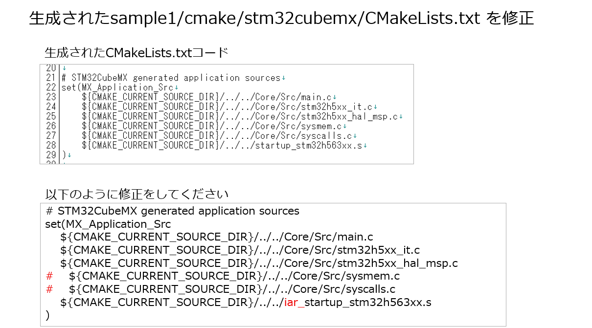
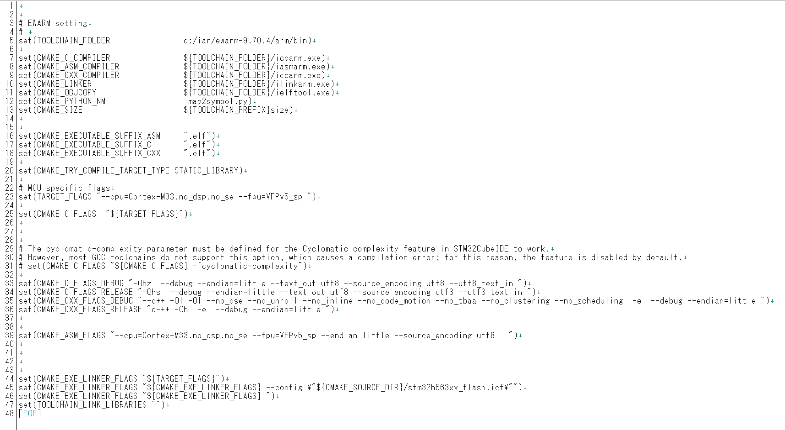
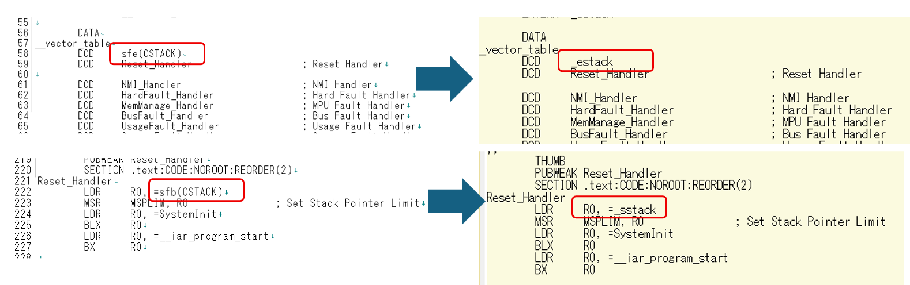

# TOPPERS/ASP3 Core の STM32 CubeMX+ IAR Embedded Workbench for ARM(EWARM) 向け環境

本ドキュメントはasp3_stm32版をベースに記述してあります。差分は入れたつもりですが、大きな変更が無い場合はそのまま利用している部分もある点はご容赦ください。

[TOPPERS/ASP3 Core](https://github.com/exshonda/asp3_core)（TECSレス・Python cfg 版 ASP3）を、
STM32CubeMX が生成する HAL プロジェクトと協調動作させる環境です。
カーネル本体は git submodule（`asp3/asp3_core`）として取り込み、STM32 固有部
（チップ層・ターゲット依存部）を本リポジトリで管理します
（[asp3_pico_sdk](https://github.com/exshonda/asp3_pico_sdk)／
[asp3_fsp](https://github.com/exshonda/asp3_fsp) と同方式）。

## 対応ボードと検証状況

| ボード | MCU | ターゲット名 | 実機検証（2026-06-12） |
|---|---|---|---|
| NUCLEO-H563ZI | STM32H563ZI（Cortex-M33） | `stm32h563_nucleo` | sample1・test_porting 6/6・testexec 32 PASS |


詳細は [docs/verification.md](docs/verification.md)、残課題は [docs/TODO.md](docs/TODO.md) を参照。

## 対応コンパイラ
IAR Embedded Workbench for ARM（EWARM)を使用。
今回使用したバージョンは9.70.4になります。

| ツール | コマンド名 | 
|---|---|
|Cコンパイラ | iccarm.exe |
|アセンブラ |  iasmarm.exe |
|リンカ     |  ilinkarm.exe |
|SREC生成  |  ielftool.exe |


またTOPPERS/ASP3ではGCCのnmの出力が必要ですが(cfg1_out.syms)、EWARMではMAPファイルから同形式の出力をするためのmap2symbol.pyというスクリプトを用意しています。
このスクリプトはsample1フォルダ直下にmap2symbol.pyとしておいています。


## ディレクトリ構成

```
asp3_stm32cube_ewarm/
├── asp3
│   ├── CMakeLists.txt			# EWARM向けCMake設定
│   ├── arch/arm_iar_iccarm/stm32h5xx_stm32cube	# チップ層（H5共通）
│   ├── asp3_core			# カーネル本体（git submodule・無変更）
│   ├── asp3_stm32cube.cmake 	# glue（ASP3_TARGET_DIR 等の解決）
│   └── target/stm32h533_nucleo	# NUCLEO-H563ZI ターゲット依存部
├── docs			 	# 検証状況・残課題
├── nucleo_h563zi/sample1		# CubeMX プロジェクト（H563ZI.ioc が正本）
└── scripts/testexec_stm32.py	# 実機向け機能テストランナー
```

`Drivers/`・`cmake/`・`*.ld`・`CMakePresets.json` は CubeMX 生成物（.gitignore 対象）で、
clone 直後はビルドできません。**最初に CubeMX で GENERATE CODE して復元**してください。

## ビルド方法

### 0. クローン
<span style="color: red; font-size: 48px;">以下コマンドでcloneしてください</span>
```bash
git clone --recursive https://github.com/iar-kk-akaboshi/asp3_stm32cube_ewarm.git
```

### 1. STM32CubeMX でコード生成

下記の URL から STM32CubeMX をダウンロードし、インストールします
（動作確認済み: 6.17.0 + FW_H5 V1.6.0。バージョンは現行版に合わせる方針）。

<https://www.st.com/ja/development-tools/stm32cubemx.html>

`nucleo_h563zi/sample1/H563ZI.ioc`（または `nucleo_h533re/sample1/H533.ioc`）を STM32CubeMX で開いて、
右上にある`GENERATE CODE`ボタンを押下します。
FW パッケージ未導入の場合はダウンロード確認が出るので許可してください。


ビルドに必要なコードが生成されます。既存のコードの変更点
（`USER CODE BEGIN/END` 間）はマージされて出力されます。

> CubeMX のヘッドレス実行（`-q`）は X ディスプレイとモーダルダイアログ操作が
> 必要なため、GUI での生成を推奨します。

### 1-b. 生成されたsample1/cmake/stm32cubemx/CMakeLists.txtの修正
STM32CubeMXで生成されたsample1/cmake/stm32cubemx/CMakeLists.txtを修正します。


### 1-c. ビルドツールに合わせてsample1/cmake/cmake/iar-iccarm.cmakeの修正
EWARMインストールパスを/sample1/cmake/iar-iccarm.cmakeにて登録しています。EWARMのバージョンが異なる場合やインストールパスが異なる場合には、こちらを変更してください。


### 2-a. コマンドラインでビルド

```bash
cd nucleo_h563zi/sample1  
cmake --preset Debug
cmake --build build/Debug # → build/Debug/H563ZI.elf
```

### 2-b. Visual Studio Code の CMake 拡張機能でビルド

Visual Studio Code で、`nucleo_h563zi/sample1`フォルダを開いて、下のステータスバーの左にある「ビルド」を押します。


## 実行・デバッグ

### コマンドラインで書込み

```Command Prompt
STM32_Programmer_CLI  -c port=SWD reset=HWrst -w build/Debug/H563ZI.elf -v -rst
```

シリアル（ST-LINK Virtual COM Port・115200 8N1）に sample1 のバナーと
`task1 is running` が出力されます。`r` を送ると task1→2→3 が切り替わります。

### Visual Studio Code でのデバッグ

'STM32 VS Code Extension'の'Create empty project'で作成した際の設定ファイルが`nucleo_h563zi/sample1/.vscode`にあります。
Visual Studio Code の「実行とデバッグ」から`Build & Debug Microcontroller - ST-Link`を選んで「デバッグの開始」ボタンを押してください。


デバッグ起動に失敗した場合、ST-Linkのファームウェアアップデートが必要な場合があります。
下記のサイトからアップデートツールをダウンロードして、ST-Linkのファームウェアをアップデートしてください。

<https://www.st.com/ja/development-tools/stsw-link007.html>

デバッグが開始し、シリアル モニタで`STMicroelectronics STLink Virtual COM Port`を開くと、下記のように表示されます。


> OpenOCD + gdb-multiarch による CLI デバッグ（vector_catch 等）の手順は
> `.claude/skills/porting-asp3-to-stm32/reference/flash-debug-tools.md` を参照。

## テスト

アプリは `-D` 指定で差し替えられます（既定は sample1）。

```bash
# 移植検証テスト（TAP 6項目）
CORE=$PWD/../asp3/asp3_core
cmake --preset Debug -B build/TestPorting \
  -DASP3_APPLDIR=$CORE/test/porting -DASP3_APPLNAME=test_porting \
  -DASP3_EXTRA_APP_C_FILES=$CORE/test/porting/tap.c
cmake --build build/TestPorting

# 機能テスト全件（実機・リポジトリルートで）
python3 scripts/testexec_stm32.py --board nucleo_h563zi
```

結果の見方・既知の非PASS は [docs/verification.md](docs/verification.md) を参照。

## ドキュメント

| 内容 | 場所 |
|---|---|
| 実機検証ホストPCの初期セットアップ（udev・FW・CubeMX初回） | [docs/host-setup.md](docs/host-setup.md) |
| 検証状況・テスト再実行手順 | [docs/verification.md](docs/verification.md) |
| 残課題 | [docs/TODO.md](docs/TODO.md) |
| 移植の経緯・root cause 解析（正本） | `asp3/asp3_core/docs/dev/stm32-integration.md` |
| 作業ガイド（新ボード追加・デバッグ・落とし穴） | `.claude/skills/porting-asp3-to-stm32/` |

## 新しいプロジェクトの作成

STM32CubeMX から新しいプロジェクトを作成して TOPPERS/ASP3 を組み込む方法を説明します。
ターゲット依存部の作成も含めた完全なチェックリストは
`.claude/skills/porting-asp3-to-stm32/checklists/new-board.md` を参照してください。

### STM32CubeMXの操作

STM32CubeMXを起動して、メニューの「File」→「New Project」を選択します。


1. 上部の「Board Selector」タブを表示します。
2. 「Commercial Part Number」に「NUCLEO-H563ZI」を入力し、右下の検索結果から「NUCLEO-H563ZI」を選択します。
3. 右上の「Start Project」ボタンを押します。

この例では「Trust Zone」は無効のまま続けています
（**TZEN 無効が前提**です。有効にする場合は [docs/TODO.md](docs/TODO.md) 参照）。
下記のダイアログはそのまま「OK」ボタンを押します。


カーネルで必要なタイマ設定を行います。


まず、フリーランニング用タイマ「TIM2」を設定します。

1. 「Timers」の中にある「TIM2」を選択します。
2. 「Clock Source」を「Internal Clock」に変更します。
3. 「Configuration」が表示されるので「Parameter Settings」タブを表示します。
4. 「Prescaler」の横にある歯車マークを押して「No check」を選択します。
5. 「Prescaler」の値を「`__LL_TIM_CALC_PSC(SystemCoreClock, 1000000)`」と入力します。


次に、割込み通知用タイマ「TIM5」を設定します。

1. 「Timers」の中にある「TIM5」を選択します。
2. 「Clock Source」を「Internal Clock」に変更します。
3. 「One Pulse Mode」にチェックを入れます。
4. 「Configuration」が表示されるので「Parameter Settings」タブを表示します。
5. 「Prescaler」の横にある歯車マークを押して「No check」を選択します。
6. 「Prescaler」の値を「`__LL_TIM_CALC_PSC(SystemCoreClock, 1000000)`」と入力します。


プロジェクト設定を入力します。

1. 「Project Name」に任意の名前を入力します。
2. 「Project Location」にプロジェクトファイルを保存するフォルダを選択します。
3. 「Toolchains / IDE」を「CMake」に変更します。

最後に、右上の「GENERATE CODE」を押してコードを生成します。

### TOPPERS/ASP3 を使えるようにする

STM32CubeMXで生成したコードを編集して、TOPPERS/ASP3 付属の「sample1」をビルドできるようにします。
既存の `nucleo_h563zi/sample1/CMakeLists.txt` が完成形なので、それを参照しながら進めてください。

#### ターゲット依存部の用意

ボードが既存ターゲットと異なる場合は、`asp3/target/` の既存ディレクトリを複製して
VCP の USART（IRQ 番号・インスタンス）等を変更します
（手順の詳細は skill の `checklists/new-board.md`）。

#### CMakeLists.txt の編集

生成された「CMakeLists.txt」に、TOPPERS/ASP3 をライブラリとしてビルドする設定を追加します。

```cmake

# ターゲット依存部（別ボードは asp3/target/ のディレクトリ名に合わせる）
set(ASP3_TARGET stm32h563_nucleo)

# STM32 協調ヘルパ（ASP3_TARGET_DIR / ASP3_CORE_DIR / ASP3_ROOT_DIR を解決）
include(../../asp3/asp3_stm32cube.cmake)

# アプリ（タスク定義）は asp3_core 同梱 sample（自作アプリに差し替え可）
# -D ASP3_APPLDIR/ASP3_APPLNAME 指定時はそれを尊重する（test_porting 等の差し替え用）
if(NOT DEFINED ASP3_APPLDIR)
    set(ASP3_APPLDIR  ${ASP3_CORE_DIR}/sample)
    set(ASP3_APPLNAME sample1)
endif()

# asp3 カーネルライブラリをライブラリ専用モードでビルド
set(ASP3_LIBRARY_ONLY ON CACHE BOOL "build asp3 as library only" FORCE)
add_subdirectory(../../asp3 asp3)

# Link directories setup
target_link_directories(${CMAKE_PROJECT_NAME} PRIVATE
    # Add user defined library search paths
)

# 最終実行ファイルに asp3・タスク本体・システムサービスを追加
# （アプリは ASP3_APPLDIR/ASP3_APPLNAME で選択。既定は sample/sample1）
target_sources(${CMAKE_PROJECT_NAME} PRIVATE
    ${ASP3_APPLDIR}/${ASP3_APPLNAME}.c
    ${ASP3_EXTRA_APP_C_FILES}
)

# Add include paths
target_include_directories(${CMAKE_PROJECT_NAME} PRIVATE
    ${ASP3_APPLDIR}
)

# Add project symbols (macros)
target_compile_definitions(${CMAKE_PROJECT_NAME} PRIVATE
    # Add user defined symbols
)

# Add linked libraries
target_link_libraries(${CMAKE_PROJECT_NAME}
    stm32cubemx

    # Add user defined libraries
    asp3
)

target_link_options(${CMAKE_PROJECT_NAME} PRIVATE
    --map
    ${CMAKE_BINARY_DIR}/${CMAKE_PROJECT_NAME}.map
)

# システムサービス（banner / syslog / serial / logtask 等）を追加
asp3_add_syssvc(${CMAKE_PROJECT_NAME})

# TOPPERS/ASP3 を使うための STM32 の設定（現状なし）
asp3_set_stm32_options(${CMAKE_PROJECT_NAME})

# TOPPERS/ASP3 のチェックを行う（シンボルがGCされるとエラーになるので省略）
#asp3_cfg_check(${CMAKE_PROJECT_NAME})
```

#### リンカスクリプトの編集は不要
\sample1\stm32h563xx_flash.icf にEWARM用のリンカ設定を配置しました。
これはSTM32CubeMXでEWARM向けで生成したリンカ設定に対して、基本的なスクリプトに以下の2行を追加しています。
define exported symbol _estack = __ICFEDIT_region_RAM_end__ + 1;
define exported symbol _sstack = __ICFEDIT_region_RAM_end__ + 1 -  __ICFEDIT_size_cstack__;

### スタートアップファイル
\sample1\iar_startup_stm32h563xx.sにEWARM用のスタートアップファイルを配置しました。
これはSTM32CubeMXでEWARM向けで生成したスタートアップファイルに対して、以下の2点を修正しています。




#### main.cの編集

`main`関数から、カーネルを起動するため`sta_ker`の呼び出しを追加します。
いずれも `USER CODE` セクション内に書くことで、CubeMX 再生成後も保持されます。

```c
/* Private includes ----------------------------------------------------------*/
/* USER CODE BEGIN Includes */
#include "target_kernel.h"      /* sta_ker の定義 */
#include "stm32h5xx_ll_tim.h"   /* プリスケーラ設定マクロ */
/* USER CODE END Includes */
```

`main`関数の無限ループ`while (1)`に入る前に`sta_ker();`を追加しカーネルを起動します。
ちなみに`sta_ker`は戻ることはありません。

```c
  /* Infinite loop */
  /* USER CODE BEGIN WHILE */
  sta_ker();
  while (1)
  {

  /* USER CODE END WHILE */

  /* USER CODE BEGIN 3 */
  }
  /* USER CODE END 3 */
```

ビルド・書込み後、シリアルにバナーと `task1 is running` が出れば完成です。
動かない場合は `.claude/skills/porting-asp3-to-stm32/checklists/bringup-debug.md`
の手順で切り分けてください。

## 制限事項

- TECS には対応していません（asp3_core は TECS レス方針）。
- TrustZone（TZEN 有効）構成は未対応です。
- CubeMX 生成物に依存するため CI ではビルドしていません（実機環境で検証）。
